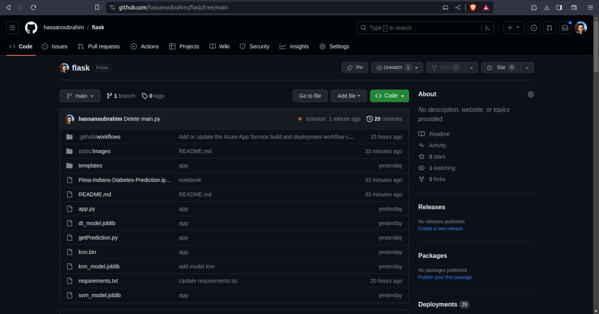

# Pima Indians Diabetes Prediction
This project aims to predict the likelihood of diabetes in Pima Indian women using machine learning models. It includes data analysis, feature selection, and a Flask application for user input and prediction. The project uses Decision Trees, Support Vector Machines (SVM), and k-Nearest Neighbors (KNN) classifiers.

# Dataset
The dataset used in this project is the Pima Indians Diabetes dataset. It contains various health-related attributes for Pima Indian women, including information on pregnancies, glucose levels, blood pressure, skin thickness, insulin levels, BMI, diabetes pedigree function, and age.

# Data Analysis
The first step in this project is importing and analyzing the Pima Indians Diabetes dataset. Exploratory Data Analysis (EDA) is performed to understand the data, identify any missing values, and visualize relationships between features and the target variable (diabetes status).

# Machine Learning Models
Three machine learning models are trained and evaluated for diabetes prediction:

Decision Tree: A decision tree classifier is used to build a predictive model based on the dataset. GridSearch is applied to find the best hyperparameters.

Support Vector Machine (SVM): An SVM classifier is trained to classify individuals as diabetic or non-diabetic. GridSearch is used for hyperparameter tuning.

k-Nearest Neighbors (KNN): The KNN algorithm is employed to make predictions based on the nearest neighbors. GridSearch is applied to optimize the choice of neighbors.

# Flask Application
A Flask web application is created to provide a user-friendly interface for making predictions. The application is hosted on Azure and connected to a GitHub repository for version control. Users can input their health-related data, and the application will provide predictions on the likelihood of diabetes using the trained machine learning models.

# Hosting 
To host this project, we follow a streamlined process that involves several key steps:
* Upload the project to Github 
* Create a web service 
* Connect Mircosoft azure with Github 
* Deploy the application 
* Test the application 

live version : https://app-flask-um6p.azurewebsites.net/app1/predict